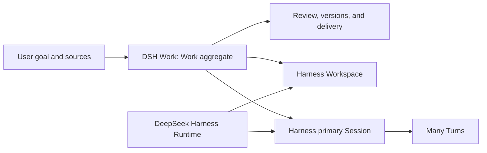

<h1 align="center">DSH Work</h1>

<p align="center">
  <strong>An AI workbench for everyday users, built on DeepSeek Harness.</strong>
</p>

<p align="center">
  Start with an outcome. Leave with a deliverable.
</p>

<p align="center"><sub>An independent community project, not affiliated with, authorized by, or endorsed by DeepSeek.<br><a href="README.md">中文</a> · English</sub></p>

<p align="center">
  
  <a href="https://github.com/zxheyi/dsh-work"></a>
</p>

DSH Work is designed to start with “What do you want to finish?” rather than asking an everyday user to choose a Workspace, create a Session, configure an Agent, or understand the runtime. The user provides a goal and sources, AI advances the same piece of work, and the user reviews evidence, revises the result, and exports a document, spreadsheet, presentation, or PDF that remains useful elsewhere.

It is neither a reimplementation of [DeepSeek Harness](https://github.com/deepseek-ai/deepseek-harness) nor a desktop replica of [DSH Desktop](https://github.com/anywhere-labs/dsh-desktop) or dsh-web. Harness provides the Agent runtime and native plugin system. DSH Work turns those capabilities into a complete work experience that ordinary users can understand, review, and deliver.

> **Current status:** the first pre-release Work loop is implemented: one Work, a managed Workspace, one Primary Session, bounded file sources, one Markdown deliverable, safe source preview, natural-language revision, explicit completion, managed export, and native delivery-location opening. Runtime recovery and readable conversation import are also present. Signing, upgrades, authorized external-conversation discovery, deliverable versions, and Office formats remain open.

**Product material:** [Interactive startup and home PRD](docs/product-prd.html) · [Complete written specification](docs/startup-and-home-prd.md) · [Familiar conversations and versioned files ADR](docs/decisions/0014-familiar-conversations-and-versioned-files.md)

## What users should be able to finish

A typical piece of work follows five continuous actions:

1. **State the goal:** describe the desired outcome in one sentence instead of starting from a blank editor or technical configuration.
2. **Add sources:** use files, webpages, data, and pasted content with an explicit import, snapshot, or reference policy.
3. **See progress:** follow phases, important findings, and questions that genuinely need a decision instead of raw tool logs.
4. **Review the deliverable:** inspect source evidence, edit directly or ask for another revision, and preserve deliverable versions.
5. **Deliver the result:** accept the Work, then export or share an office deliverable that can be used elsewhere.

The first common office scenarios include:

- drafting, summarizing, rewriting, and translating documents;
- cleaning spreadsheets, analyzing data, finding anomalies, and producing charts;
- structuring presentations and preparing reporting material;
- multi-source research, comparison, verification, and reporting;
- organizing meeting or project material into recurring deliverables.

## How it differs from Harness and DSH Desktop

| Product | Default entry point | Primary objects | Primary value |
| --- | --- | --- | --- |
| DeepSeek Harness | Workspaces, Sessions, Agents, and tools | Agent execution and extensions | A composable runtime and plugin foundation |
| DSH Desktop | Install and run Harness | Desktop host and Harness capabilities | An out-of-the-box Harness desktop experience |
| DSH Work | What do you want to finish? | Work, sources, progress, and deliverables | Help everyday users finish and deliver real work |

DSH Desktop may inform architectural choices, but it is not the DSH Work product specification, feature checklist, or visual template. DSH Work does not promise feature, interface, interaction, or release-schedule parity and chooses priorities from its own users and work scenarios.

## Core product model

DSH Work introduces **Work**, a product-owned aggregate above Harness Workspace and Session:

```text
1 Work = 1 managed Workspace + 1 primary Session + many Turns + many deliverable versions
```

- **Workspace holds files:** a persistent local working directory in Harness, prepared automatically when DSH Work creates a Work.
- **Session records the process:** the primary Session retains continuous conversation and execution history; ordinary revisions append Turns.
- **Work owns the result:** DSH Work retains the goal, source references, Harness object links, deliverable versions, review, completion, and delivery state.
- **Related Sessions are exceptional:** create one explicitly for parallel work, a fork, isolation, or a genuinely different working directory.
- **Sources are not Workspaces:** adding a file, webpage, or pasted content does not create another Workspace.

A Session or Turn ending means an AI activity ended, not that the user's Work is complete. Only user acceptance moves a Work to `completed`; a successful export or share moves it to `delivered`. See [ADR 0006](docs/decisions/0006-work-as-product-owned-aggregate.md) for the complete decision.

## Product boundary

The first product slice must prove one complete loop: start from a one-sentence goal and real sources, produce an AI-native deliverable whose evidence can be inspected, continue revising it, and export it.

The first slice explicitly does not include:

- a full replica of Word, Excel, or PowerPoint;
- lossless round trips for complex Office files;
- an Agent, model, step, or execution-topology console for everyday users;
- traditional project management centered on schedules, boards, staffing, or time tracking;
- default multi-Workspace orchestration;
- a DSH Desktop clone or a second Harness runtime and plugin protocol.

In-app editing centers on deliverables owned by DSH Work. Office files are important input and delivery formats, while rich text, formulas, charts, comments, animation, and lossless compatibility remain separate major capabilities.

## Architecture principles

DSH Work implements product capabilities as Harness-native plugins and keeps Electron as a thin, secure desktop host.



| Owner | Responsibility |
| --- | --- |
| DeepSeek Harness | Workspace, Session, Turn, Agent Loop, tools, authorization, Profile, Bundle, and plugin lifecycle |
| DSH Work Host plugins | Work persistence, object links, recoverable orchestration, and the product deliverable model |
| DSH Work Client plugins | Goal, sources, progress, review, editing, and delivery surfaces |
| Electron | Windows, operating-system integration, process lifecycle, diagnostics, and recovery |

Core constraints:

- compose product capabilities through native Harness Profiles, Bundles, Host plugins, Remotes, and Client plugins;
- keep pinned upstream source read-only and byte-clean instead of copying or changing Harness core;
- do not put the Work database or Agent orchestration in the Electron renderer;
- propose an upstream extension when verified user outcomes exceed public seams instead of creating a parallel protocol;
- run a real Profile and Loader smoke for external Client plugins against the locked Harness alpha version.

## Current implementation and direction

The repository currently establishes:

- an Electron desktop host and secure window boundary;
- official DeepSeek Harness alpha.2 CLI, Profile, and Bundle composition;
- a crash-safe external guardian, Profile generations, and explicit recovery;
- TypeScript product source, builds, unit and contract tests, and native desktop verification.
- a persistent singleton Work with a managed Workspace, Primary Session, Turns, bounded file-resource import, and readable conversation import;
- one Primary-Session-produced Markdown deliverable with safe in-app preview and natural-language revision;
- explicit completion, managed export, and native delivery-location opening.

The next product stage will validate real model and permission flows, improve progress and failure recovery, and design deliverable versions. Spreadsheet, presentation, PDF, and complex Office round trips remain product direction rather than implemented UI.

## Development and contributing

Read [`AGENTS.md`](AGENTS.md), [`docs/product-scope.md`](docs/product-scope.md), [`docs/workflow.md`](docs/workflow.md), and [`docs/decisions/README.md`](docs/decisions/README.md) before starting work. The current milestone, runtime inputs, and upstream compatibility boundary live in [`docs/acceptance/m0.md`](docs/acceptance/m0.md), [`runtime/README.md`](runtime/README.md), and [`docs/upstream-compatibility.md`](docs/upstream-compatibility.md).

Install the frozen dependency graph and run the repository gates:

```bash
pnpm install --frozen-lockfile --ignore-scripts
pnpm build
pnpm test
pnpm check
```

Before proposing a large implementation, use GitHub Issues to discuss the user outcome, product scope, architecture decision, or plugin boundary.

## Relationship to DeepSeek Harness

DSH Work is an independent community project built on DeepSeek Harness. It is not affiliated with, authorized by, or endorsed by DeepSeek or the official DeepSeek Harness team. For command-line usage, core capabilities, and upstream contributions, refer to the official [DeepSeek Harness repository](https://github.com/deepseek-ai/deepseek-harness). See the official [brand guidelines](https://github.com/deepseek-ai/deepseek-harness/blob/master/BRAND_GUIDELINES.md) for authoritative naming and trademark guidance.

## License

The project is intended to be released as open source, but a license has not been selected yet. A license file will be added before substantive external contributions are accepted.

> “DeepSeek Harness” is a registered trademark of DeepSeek. The name is used here solely to accurately describe compatibility, technical origin, and this project's relationship to upstream software.
