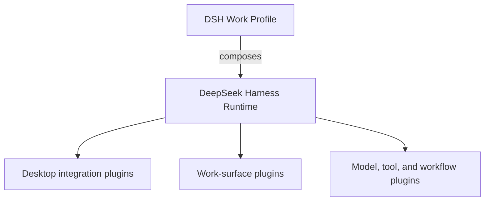

<h1 align="center">DSH Work</h1>

<p align="center">
  <strong>A plugin-native AI desktop for real work, built on DeepSeek Harness.</strong>
</p>

<p align="center">
  Bring projects, files, web research, artifacts, and Agents into one working environment.
</p>

<p align="center"><sub>An independent community project, not affiliated with, authorized by, or endorsed by DeepSeek.<br><a href="README.md">中文</a> · English</sub></p>

<p align="center">
  
  <a href="https://github.com/zxheyi/dsh-work"></a>
</p>

DSH Work does not aim to reimplement [DeepSeek Harness](https://github.com/deepseek-ai/deepseek-harness). It aims to build a desktop product layer for real work on top of the upstream Agent runtime and plugin architecture. The desktop shell should own only operating-system integration and process lifecycle; project, file, research, artifact, and other work capabilities should be composed through Harness-native plugins.

> **Current status:** Electron, the official Harness alpha.2 runtime boundary, frozen dependencies, and native verification path are on main. The external guardian and persistent Profile-generation recovery are undergoing native verification; there is no packaged release ready for daily use.

## Why DSH Work

DeepSeek Harness already provides the Agent runtime, sessions, tools, models, and plugin mechanism. DSH Work intends to provide a unified desktop entry point for broader work without changing those core boundaries: organizing project context, working with Agents, reviewing web and file sources, and producing inspectable deliverables.

DSH Work is not another Agent kernel, and it will not create a plugin platform alongside Harness. It should be a desktop distribution composed from DSH Bundles, Profiles, and native plugins.

## Design principles

- **Everything is a plugin:** deliver product capabilities through native DeepSeek Harness plugins whenever possible.
- **Keep the host thin:** limit the native desktop host to windows, system integration, and lifecycle responsibilities.
- **Compose instead of fork:** keep pinned upstream source read-only and free of product changes; prefer upstream composition over modifying, copying, or reimplementing Harness core.
- **Keep capabilities replaceable:** work surfaces, tools, models, workflows, and data connections should be independently installable, replaceable, and removable.
- **Make boundaries explicit:** permissions, credentials, local resource access, and plugin ownership should remain visible to users.
- **Do not invent a second protocol:** avoid DSH Work extension APIs that are incompatible with native Harness plugins.

If a verified user outcome cannot be delivered through native Harness Profiles, Bundles, plugins, or public services, propose and pursue an upstream extension first. Do not turn that gap into a second Harness inside DSH Work.

## Target architecture



| Layer | Target responsibility | Intended form |
| --- | --- | --- |
| DeepSeek Harness | Agent runtime, sessions, and plugin lifecycle | Preserve upstream boundaries |
| DSH Work Profile | Select default Bundles and plugin composition | DSH Profile |
| Desktop integration | Windows, tray, process startup, and recovery | Harness-native plugins with a thin native shell |
| Work surfaces | Projects, files, web research, and artifacts | Harness Client plugins |
| Ecosystem capabilities | Models, tools, Skills, MCP, and workflows | Upstream or community plugins |

This is the current architectural target. Final interfaces and repository structure still require implementation validation.

## Planned direction

- A desktop host that starts, stops, and recovers a local DeepSeek Harness instance.
- Work surfaces for projects, files, web research, and generated artifacts.
- Bundle- and Profile-based plugin discovery, installation, configuration, and lifecycle management.
- Clear permission, diagnostics, and recovery experiences for desktop users.
- Composition with upstream and community plugins without hardcoding product capabilities into the desktop shell.

## Relationship to DeepSeek Harness

DSH Work is an independent community project built on DeepSeek Harness. It is not affiliated with, authorized by, or endorsed by DeepSeek or the official DeepSeek Harness team.

The upstream project provides the Agent runtime and plugin architecture. DSH Work intends to provide a desktop product layer composed through those native extension points. For command-line usage, core capabilities, and upstream contributions, refer to the official [DeepSeek Harness repository](https://github.com/deepseek-ai/deepseek-harness). See the official [brand guidelines](https://github.com/deepseek-ai/deepseek-harness/blob/master/BRAND_GUIDELINES.md) for authoritative naming and trademark guidance.

## Development and contributing

The repository has completed its first desktop-stack and upstream-integration decisions and has promoted the accepted runtime baseline to main. Phase 0 establishes the repository contract. Read [`AGENTS.md`](AGENTS.md) and [`docs/workflow.md`](docs/workflow.md) before starting work. The frozen Chinese v1 record of the AI Native delivery workflow lives in [`docs/workflow-v1.zh-CN.md`](docs/workflow-v1.zh-CN.md). The current product scope, first milestone, runtime inputs, and decision process live in [`docs/product-scope.md`](docs/product-scope.md), [`docs/acceptance/m0.md`](docs/acceptance/m0.md), [`runtime/README.md`](runtime/README.md), and [`docs/decisions/README.md`](docs/decisions/README.md).

Install the frozen dependency graph and run the repository gates:

```bash
pnpm install --frozen-lockfile --ignore-scripts
pnpm test
pnpm check
```

See [`runtime/README.md`](runtime/README.md) for the complete official source, npm package, and native Node byte verification, and [`docs/acceptance/electron-lifecycle-slice.md`](docs/acceptance/electron-lifecycle-slice.md) for the minimum Electron lifecycle boundary and acceptance contract.

Before proposing a large implementation, use GitHub Issues to discuss product scope, architecture decisions, or plugin boundaries.

## License

The project is intended to be released as open source, but a license has not been selected yet. A license file will be added before substantive external contributions are accepted.

> “DeepSeek Harness” is a registered trademark of DeepSeek. The name is used here solely to accurately describe compatibility, technical origin, and this project's relationship to upstream software.
