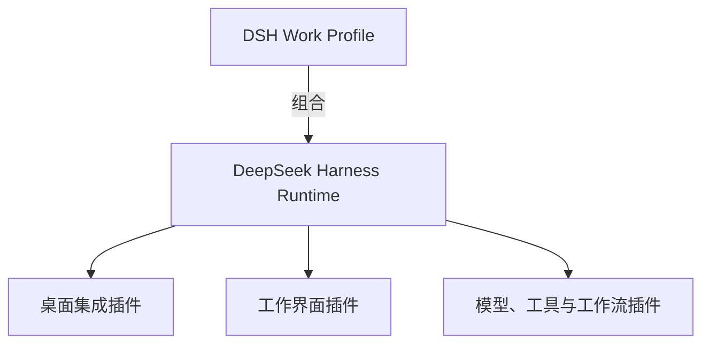

<h1 align="center">DSH Work</h1>

<p align="center">
  <strong>基于 DeepSeek Harness 构建、原生遵循其插件体系的 AI 工作桌面。</strong>
</p>

<p align="center">
  让项目、文件、网页、产物与 Agent 在同一个工作环境中协作。
</p>

<p align="center"><sub>独立社区项目，与深度求索不存在隶属、合作、授权或背书关系。<br>中文 · <a href="README.en.md">English</a></sub></p>

<p align="center">
  
  <a href="https://github.com/zxheyi/dsh-work"></a>
</p>

DSH Work 的目标不是重新实现 [DeepSeek Harness](https://github.com/deepseek-ai/deepseek-harness)，而是在其 Agent 运行时和插件架构之上构建面向真实工作的桌面产品层。桌面壳只负责操作系统集成和进程生命周期；项目、文件、研究、产物与其他工作能力应通过 Harness 原生插件进行组合。

> **当前状态：** Electron、官方 Harness alpha.2 运行时边界、外部 guardian 与持久 Profile 代际恢复均已通过 macOS/Windows 原生验证。暂时没有可供日常使用的打包版本。

## 为什么做 DSH Work

DeepSeek Harness 已经提供 Agent 运行时、会话、工具、模型与插件机制。DSH Work 希望在不改变这些核心边界的前提下，为更广泛的工作场景提供统一桌面入口：组织项目上下文、调用 Agent、查阅网页和文件，并承接可复查的工作产物。

DSH Work 不是另一套 Agent 内核，也不会建立与 Harness 并行的插件平台。它应当是一套由 DSH Bundle、Profile 与原生插件组合出来的桌面发行配置。

## 设计原则

- **万物皆插件：** 产品能力优先通过 DeepSeek Harness 原生插件实现。
- **保持宿主轻薄：** 原生桌面宿主只处理窗口、系统集成和生命周期等平台职责。
- **组合而非分叉：** 固定的上游源码保持只读、无产品改动；优先组合上游能力，不修改、复制或重新实现 Harness 核心。
- **能力可替换：** 工作界面、工具、模型、工作流和数据连接应当可以独立安装、替换与移除。
- **边界明确：** 权限、凭据、本地资源访问和插件归属应当对用户可见。
- **不造第二套协议：** 不为 DSH Work 创建与 Harness 原生插件不兼容的扩展 API。

如果已验证的用户结果无法通过 Harness 原生 Profile、Bundle、插件或公共服务实现，应先提出并推动上游扩展；不能把能力缺口变成 DSH Work 内部的第二套 Harness。

## 目标架构



| 层级 | 目标职责 | 预期形态 |
| --- | --- | --- |
| DeepSeek Harness | Agent 运行时、会话与插件生命周期 | 保持上游边界 |
| DSH Work Profile | 选择默认 Bundle 与插件组合 | DSH Profile |
| 桌面集成 | 窗口、托盘、进程启动与恢复 | Harness 原生插件与轻量原生壳 |
| 工作界面 | 项目、文件、网页、研究与产物 | Harness Client 插件 |
| 生态能力 | 模型、工具、Skill、MCP 与工作流 | 上游或社区插件 |

该架构是当前设计目标，最终接口和目录结构仍待实现验证。

## 规划方向

- 启动、停止和恢复本地 DeepSeek Harness 的桌面宿主。
- 面向项目、文件、网页研究和生成产物的工作界面。
- 基于 Bundle 与 Profile 的插件发现、安装、配置和生命周期管理。
- 面向桌面用户的权限说明、运行诊断和故障恢复体验。
- 保持上游插件与社区插件的组合能力，避免把产品功能固化在桌面壳中。

## 与 DeepSeek Harness 的关系

DSH Work 是基于 DeepSeek Harness 构建的独立社区项目，与深度求索及 DeepSeek Harness 官方团队不存在隶属、合作、授权或背书关系。

上游项目提供 Agent 运行时和插件架构；DSH Work 计划提供通过这些原生扩展点组合而成的桌面产品层。命令行使用、核心能力和上游贡献请优先参考 [DeepSeek Harness 官方仓库](https://github.com/deepseek-ai/deepseek-harness)。项目命名与品牌说明以官方[品牌使用规范](https://github.com/deepseek-ai/deepseek-harness/blob/master/BRAND_GUIDELINES.md)为准。

## 开发与参与

仓库已完成首轮桌面技术栈与上游集成决策，并将已接受的运行时基线提炼进主线。Phase 0 已建立仓库契约；开始工作前请阅读 [`AGENTS.md`](AGENTS.md) 与 [`docs/workflow.md`](docs/workflow.md)。AI Native 交付工作流的中文 v1 冻结记录见 [`docs/workflow-v1.zh-CN.md`](docs/workflow-v1.zh-CN.md)。当前产品范围、首个里程碑、运行时输入和架构决策流程分别见 [`docs/product-scope.md`](docs/product-scope.md)、[`docs/acceptance/m0.md`](docs/acceptance/m0.md)、[`runtime/README.md`](runtime/README.md) 和 [`docs/decisions/README.md`](docs/decisions/README.md)。

安装固定依赖并执行仓库门禁：

```bash
pnpm install --frozen-lockfile --ignore-scripts
pnpm test
pnpm check
```

完整的官方源码、npm 包与原生 Node 字节验证见 [`runtime/README.md`](runtime/README.md)，最小 Electron 生命周期的边界与验收见 [`docs/acceptance/electron-lifecycle-slice.md`](docs/acceptance/electron-lifecycle-slice.md)。

在提交大规模实现前，请先通过 GitHub Issues 讨论产品范围、架构决策或插件边界。

## License

项目计划以开源方式发布，但尚未选定许可证。正式接受实质性外部贡献前将补充许可证文件。

> “DeepSeek Harness”是深度求索的注册商标。本文仅为准确说明兼容性、技术来源及与上游软件的关系而使用该名称。
