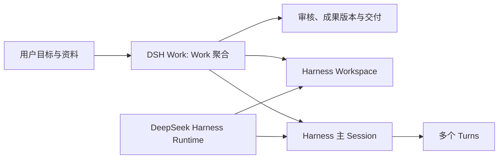

<h1 align="center">DSH Work</h1>

DSH Work 基于 DeepSeek Harness 构建，是独立社区项目，非 DeepSeek 官方产品。

<p align="center">
  <strong>面向普通用户的 AI 工作台，基于 DeepSeek Harness 构建。</strong>
</p>

<p align="center">
  从目标开始，把成果带走。
</p>

<p align="center"><sub>独立社区项目，与深度求索不存在隶属、合作、授权或背书关系。<br>中文 · <a href="README.en.md">English</a></sub></p>

<p align="center">
  
  <a href="https://github.com/zxheyi/dsh-work"></a>
</p>

DSH Work 希望让普通用户从“我想完成什么”开始，而不是先选择 Workspace、创建 Session、配置 Agent 或理解运行时。用户提供目标和资料，AI 在同一项工作中持续推进，用户检查来源、审核和修改成果，最后导出可以继续使用的文档、表格、演示文稿或 PDF。

它不是 [DeepSeek Harness](https://github.com/deepseek-ai/deepseek-harness) 的重新实现，也不是 [DSH Desktop](https://github.com/anywhere-labs/dsh-desktop) 或 dsh-web 的桌面复刻。Harness 提供 Agent 运行时与原生插件体系；DSH Work 负责把这些能力组织成普通用户能够理解、审核和交付的完整工作体验。

> **当前状态：** 已打通首个发行前闭环：单 Work、受管 Workspace、Primary Session、多 Turn、受控文件资料、单一 Markdown 成果生产、安全原文预览、自然语言修改、确认完成、导出副本与 Finder 展示；同时支持重启恢复、失败继续，以及把已有对话的可读内容安全复制到新 Work。安装包签名、升级、外部会话自动发现、多成果版本和 Office 格式仍未完成。

**产品资料：** [查看交互式启动与首页 PRD](docs/product-prd.html) · [阅读完整文字规格](docs/startup-and-home-prd.md) · [阅读熟悉会话与版本化文件 ADR](docs/decisions/0014-familiar-conversations-and-versioned-files.md)

## 用户可以完成什么

一项典型工作由五个连续动作组成：

1. **说出目标：** 用一句话描述想要的结果，不从空白编辑器或技术配置开始。
2. **添加资料：** 使用文件、网页、数据和粘贴内容，并明确导入、快照或引用方式。
3. **看见进展：** 查看阶段、关键发现和真正需要确认的问题，不直接面对原始工具日志。
4. **审核成果：** 检查资料依据，直接修改或用自然语言继续修改，保留成果版本。
5. **完成交付：** 用户确认后完成工作，再导出或分享可继续使用的办公成果。

首批希望覆盖的常见办公场景包括：

- 文档撰写、总结、改写与翻译；
- 表格整理、数据分析、异常发现与图表；
- 演示文稿结构、内容与汇报材料；
- 多来源调研、比较、核验与报告；
- 会议资料、项目资料和周期性汇报的整理与交付。

## 与 Harness 和 DSH Desktop 的区别

| 产品 | 默认入口 | 主要对象 | 主要价值 |
| --- | --- | --- | --- |
| DeepSeek Harness | Workspace、Session、Agent 与工具 | Agent 运行和扩展能力 | 提供可组合的运行时与插件基础 |
| DSH Desktop | 安装并运行 Harness | 桌面宿主与 Harness 能力 | 提供开箱即用的 Harness 桌面体验 |
| DSH Work | 你想完成什么？ | 工作、资料、进展与成果 | 帮助普通用户完成并交付一件真实工作 |

DSH Desktop 可以作为架构参考，但不是 DSH Work 的产品规格、功能清单或视觉模板。DSH Work 不承诺功能、界面、交互或发布节奏一致，并根据自己的目标用户与工作场景决定优先级。

## 核心产品模型

DSH Work 引入 **Work（工作）**，作为位于 Harness Workspace 和 Session 之上的产品聚合：

```text
1 Work = 1 个受管 Workspace + 1 个主 Session + 多个 Turn + 多个成果版本
```

- **Workspace 放文件：** Harness 持久保存的本地工作目录，由 DSH Work 在创建工作时自动准备。
- **Session 记过程：** 主 Session 保存持续的对话和执行历史，普通修改继续追加 Turn。
- **Work 管结果：** DSH Work 保存目标、资料引用、Harness 对象关联、成果版本、审核、完成与交付状态。
- **相关 Session 是例外：** 只在并行、分叉、隔离或确实需要另一工作目录时显式创建。
- **资料不是 Workspace：** 添加文件、网页或粘贴内容不会创建新的 Workspace。

Session 或 Turn 结束只代表一次 AI 活动结束，不代表用户已经完成工作。只有用户接受当前成果，Work 才进入“已完成”；成功导出或分享后才进入“已交付”。完整决策见 [ADR 0006](docs/decisions/0006-work-as-product-owned-aggregate.md)。

## 产品边界

首版需要证明一个完整闭环：从一句话目标和真实资料开始，形成可以检查来源、继续修改并导出的 AI 原生成果。

首版明确不做：

- 完整复刻 Word、Excel 或 PowerPoint；
- 承诺复杂 Office 文件的无损往返；
- 让普通用户配置 Agent、模型、步骤或执行拓扑；
- 从排期、看板、人员和工时开始做传统项目管理；
- 默认编排多个 Workspace；
- 复刻 DSH Desktop 或建立第二套 Harness 与插件协议。

应用内编辑优先面向 DSH Work 自己拥有的成果模型；Office 文件是重要的输入与交付格式，但完整富文本、公式、图表、批注、动画和无损兼容属于独立的大型能力。

## 架构原则

DSH Work 使用 Harness 原生插件实现产品能力，Electron 保持为轻量且安全的桌面宿主。



| 所有者 | 职责 |
| --- | --- |
| DeepSeek Harness | Workspace、Session、Turn、Agent Loop、工具、权限、Profile、Bundle 与插件生命周期 |
| DSH Work Host 插件 | Work 持久化、对象关联、可恢复编排与产品级成果模型 |
| DSH Work Client 插件 | 目标、资料、进展、审核、编辑与交付界面 |
| Electron | 窗口、系统集成、进程生命周期、诊断与恢复 |

核心约束：

- 产品能力优先通过 Harness 原生 Profile、Bundle、Host 插件、Remote 和 Client 插件组合；
- 固定的上游源码保持只读和字节一致，不复制或修改 Harness 核心；
- 不把 Work 数据库或 Agent 编排放进 Electron renderer；
- 如果公共扩展点不能满足经过验证的用户结果，先提出上游扩展，而不是建立平行协议；
- 外部 Client 插件仍需针对锁定的 Harness alpha 版本执行真实 Profile 与 Loader 冒烟验证。

## 当前实现与路线

仓库当前已经建立：

- Electron 桌面宿主和安全窗口边界；
- 官方 DeepSeek Harness alpha.2 CLI、Profile 与 Bundle 组合；
- crash-safe 外部 guardian、Profile 代际和显式恢复；
- TypeScript 产品源码、构建、单元测试、契约测试和原生桌面验证。
- 最小 Work 聚合、持久化与失败恢复；
- Web／Desktop 共用的 Work Remote、Client API 与修订绑定命令；
- 面向目标的桌面首页，以及把可读既有对话复制到新 Work 的安全导入入口。
- 最多 20 个、单文件 25 MiB 的受控文件资料导入，不要求用户选择 Workspace 目录；
- 由 Primary Session 生产固定 Markdown 成果，并在应用内安全预览、用自然语言继续修改；
- 用户确认完成后导出受管副本，并通过 Harness 原生路径能力在 Finder 中显示交付位置。

下一阶段将重点验证真实模型与权限流程、补充进度和失败恢复体验、设计多成果版本，并在上游提供明确授权的来源契约后接入外部会话自动发现。表格、演示、PDF 和复杂 Office 往返仍是产品方向，不代表已经交付。

## 开发与参与

开始工作前请阅读 [`AGENTS.md`](AGENTS.md)、[`docs/product-scope.md`](docs/product-scope.md)、[`docs/workflow.md`](docs/workflow.md) 和 [`docs/decisions/README.md`](docs/decisions/README.md)。当前里程碑、运行时输入和上游兼容边界分别见 [`docs/acceptance/m0.md`](docs/acceptance/m0.md)、[`runtime/README.md`](runtime/README.md) 与 [`docs/upstream-compatibility.md`](docs/upstream-compatibility.md)。

安装固定依赖并执行仓库门禁：

```bash
pnpm install --frozen-lockfile --ignore-scripts
pnpm build
pnpm test
pnpm check
```

在提交大规模实现前，请先通过 GitHub Issues 讨论用户结果、产品范围、架构决策或插件边界。

## 与 DeepSeek Harness 的关系

DSH Work 是基于 DeepSeek Harness 构建的独立社区项目，与深度求索及 DeepSeek Harness 官方团队不存在隶属、合作、授权或背书关系。命令行使用、核心能力和上游贡献请优先参考 [DeepSeek Harness 官方仓库](https://github.com/deepseek-ai/deepseek-harness)。项目命名与品牌说明以官方[品牌使用规范](https://github.com/deepseek-ai/deepseek-harness/blob/master/BRAND_GUIDELINES.md)为准。

## License

项目采用 [MIT 许可证](LICENSE)，版权署名为 DSH Work contributors。第三方依赖保留各自许可证，见 [分发许可清单](third-party/README.md)；项目采用 MIT 不代表依赖都采用 MIT。

> “DeepSeek Harness”是深度求索的注册商标。本文仅为准确说明兼容性、技术来源及与上游软件的关系而使用该名称。
