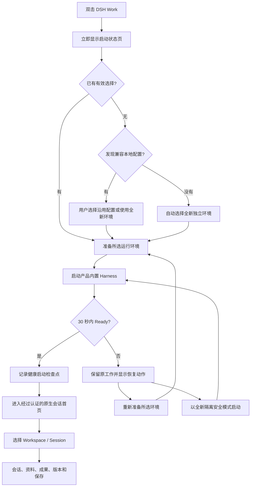
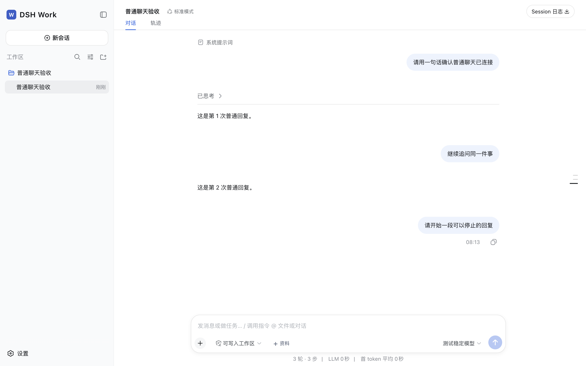
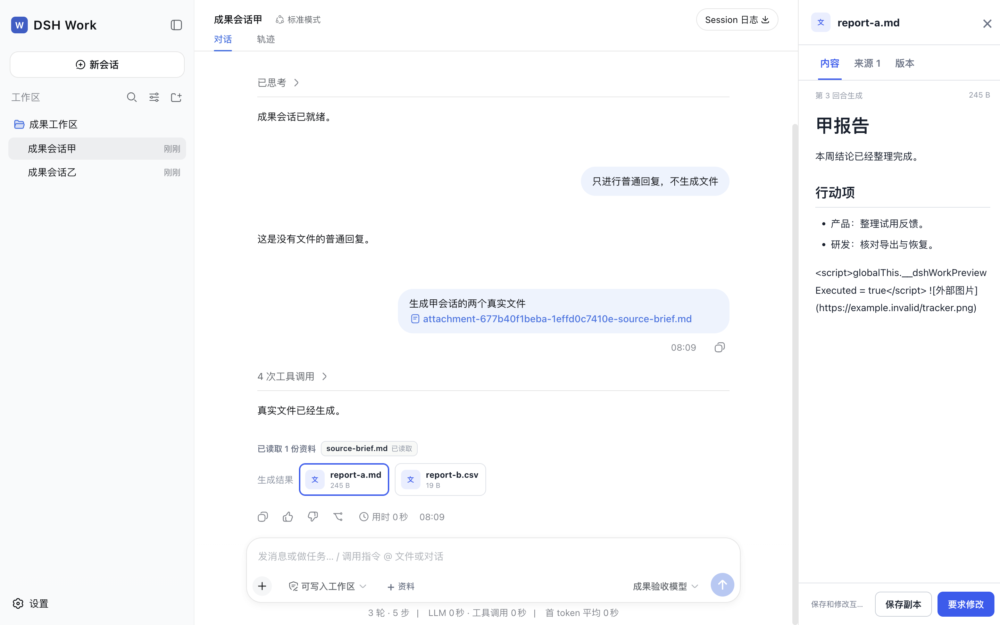

# DSH Work 启动与首页 PRD

> 最新可交互设计：[`docs/design/startup-home-v2/index.html`](design/startup-home-v2/index.html)

Status: current implementation baseline; startup acceptance passed; home automated acceptance passed with one human-usability gate pending

Version: 1.0

Date: 2026-09-07

Owners: Product, Design, Desktop, Harness integration

## 1. 文档目的

本文定义用户从双击 DSH Work 到开始第一轮工作，再到查看、修改和保存文件成果的完整产品体验。它同时是启动页、应用首页和首页内核心工作路径的统一规格。

本文以当前代码和已接受契约为准，覆盖以下两层：

1. **桌面启动层：** 选择是否沿用已有 DSH 配置、准备受管运行环境、展示状态、处理失败、切换到安全模式，以及关闭窗口后的托盘行为。
2. **工作首页层：** 沿用 DSH Web 和 DSH Desktop 用户熟悉的 Workspace、Session、会话、模型、模式和设置结构，并在会话旁增加资料、成果预览、来源、版本、采用和保存能力。

本文与当前的[交互式 PRD](product-prd.html)共同取代早期“必须先创建 Work、填写目标和成果类型”的首页概念，作为当前启动与首页的产品基线。早期方案仍保留在 Git 历史中，不代表当前首页。

事实来源：

- [产品范围](product-scope.md)
- [ADR 0014：熟悉的会话与版本化文件](decisions/0014-familiar-conversations-and-versioned-files.md)
- [ADR 0015：不可变 Session 文件版本](decisions/0015-immutable-session-output-versions.md)
- [ADR 0016：熟悉的桌面启动与本地 Harness 兼容](decisions/0016-familiar-desktop-startup.md)
- [桌面启动验收](acceptance/familiar-desktop-startup.md)
- [Familiar Work v5 验收](acceptance/familiar-work-v5.md)

## 2. 产品定义

DSH Work 是基于 DeepSeek Harness 的桌面工作环境。它向普通用户提供熟悉的会话入口，并把真实文件资料、生成结果、版本检查和交付动作放在同一条工作路径中。

产品不要求用户理解新的 Work 对象，也不要求用户先填写目标表单。用户进入应用后，选择或创建 Workspace，打开 Session，直接输入问题或任务即可开始。

### 2.1 核心承诺

- 已使用过 DSH 的用户可以明确选择沿用兼容的登录状态、设置与工作记录。
- DSH Work 始终运行随产品验证和打包的 Harness 与 Node，不执行机器上未知版本的 `dsh`、Node 或 pnpm。
- 用户原有 Profile 的声明文件和依赖保持不变；DSH Work 在自己的运行目录中完成组合。
- 没有旧配置的用户直接获得一个独立的新环境。
- 首页延续 Workspace、Session、模型、模式、权限和设置等原生语义。
- 普通问答可以直接进行；文件能力只在确实存在资料或成果时出现。
- 长时间运行的 Agent 在用户关闭窗口时继续工作，并可从系统托盘重新打开。

### 2.2 目标用户

| 用户 | 当前状态 | 核心诉求 |
| --- | --- | --- |
| 已有 DSH Desktop / DSH Web 用户 | 已有 Profile、模型设置和历史 Session | 打开新应用后继续原来的使用习惯和数据，不重新学习一套对象 |
| 首次使用 DSH 的用户 | 没有本地配置 | 快速得到可用环境，完成模型设置后直接开始会话 |
| 需要长任务的用户 | Agent 可能运行数分钟或更久 | 关掉窗口不会误停任务，仍能明确停止或退出 |
| 以文件为结果的用户 | 需要导入资料、检查和交付结果 | 在会话旁阅读真实成果、核对来源、修改版本并保存副本 |

### 2.3 产品原则

1. **熟悉优先：** 使用 Workspace、Session、会话、模型、模式和设置等现有 DSH 概念。
2. **状态先于技术：** 启动页告诉用户“正在打开、已就绪、暂时失败”，诊断码只作为次要信息。
3. **原数据可控：** 复用旧配置必须由用户首次明确选择；安全模式不读取共享数据。
4. **真实结果驱动：** 只有经过校验的实际文件才显示为成果。
5. **失败不丢上下文：** 草稿、文件选择、上一有效成果和版本记录在可恢复范围内保留。
6. **职责单一：** Harness 管理 Agent、Session、模型、工具、权限和认证；DSH Work 管理桌面宿主、运行组合、恢复和文件工作体验。

## 3. 体验总览



## 4. 启动流程

### 4.1 阶段 A：桌面应用建立

用户动作：双击应用图标、从 Dock / 任务栏打开，或在已有实例运行时再次打开。

系统行为：

- 建立单实例；再次打开时显示已有窗口，不启动第二套运行环境。
- 先创建受沙箱保护的桌面窗口，并加载本地启动状态页。
- 启动状态页必须早于 Harness 进程启动出现，避免白屏和不可解释的等待。
- 窗口只接收固定启动命令和有界状态，不获得通用文件、shell 或 Electron 能力。

用户可见：

- 品牌：`DSH Work`
- 主标题：`正在准备你的工作台`
- 说明：`稍等片刻，我们会继续你最近的工作。`
- 页脚：`已有工作会自动保留`

### 4.2 阶段 B：确定使用哪个数据环境

#### 情形 B1：机器上没有兼容配置

系统自动记住“全新环境”，不要求用户做没有意义的选择，并继续启动。

#### 情形 B2：首次打开且发现兼容配置

启动页显示首次选择卡：

- 标题：`继续使用已有 DSH 配置`
- 解释：可以沿用熟悉的登录状态、设置与工作记录；DSH Work 只在自己的目录中组合运行。
- 配置下拉框只显示经过约束的配置名称，不显示机器路径。
- 主动作：`继续并打开`
- 次动作：`使用全新环境`
- 风险提示：`使用已有配置时，请先关闭其他正在运行的 DSH 应用。`

用户选择后，结果写入 DSH Work 自己的偏好文件。后续启动直接使用该选择。

#### 情形 B3：已有有效选择

系统重新发现并校验所选配置。有效时直接准备运行环境，不重复展示选择卡。

#### 情形 B4：记住的配置已经不存在或不再兼容

系统不猜测替代配置，也不使用旧路径继续启动。选择失效后重新进入首次选择流程；若当前没有兼容配置，则使用全新独立环境。

#### 本地配置兼容条件

当前只接受符合受支持 Profile 结构的普通目录，且 Bundle 的前两项依次为 `@deepseek-ai/dsh-base` 和 `@deepseek-ai/dsh-web-app`。发现过程遵守以下边界：

- 从 `$DSH_HOME` 或默认 `~/.dsh` 下发现 Profile。
- 不跟随符号链接，不接受超大或畸形清单。
- 最多向界面提供 32 个配置；名称最多 128 字节。
- 界面只接收 24 位内部标识、配置名称和符号化 Home 标签。
- 不向启动页面暴露绝对路径、清单内容、补丁、凭据、设置或 Session 内容。

### 4.3 阶段 C：准备运行环境

DSH Work 根据选择创建一次新的产品自有运行代次。

| 模式 | 数据来源 | 运行组合 | 用户原配置 |
| --- | --- | --- | --- |
| 全新环境 | DSH Work 自有数据目录 | 产品默认 Profile + DSH Work 插件 | 不读取、不修改 |
| 沿用配置 | 用户选中的 Harness 数据 Home | 在产品目录内创建 Shadow Profile，并挂载 DSH Work 与生命周期插件 | Profile 清单、补丁和依赖保持字节不变；Harness 管理的数据服务继续使用用户批准的 Home |
| 安全模式 | 新建隔离代次 | 产品默认 Profile，不打开共享数据 | 保留但不访问 |

无论使用哪种模式，执行文件都来自产品已验证的 Harness 与 Node 组合。机器上已经安装的 `dsh` 可以作为数据来源的背景条件，但不会替换产品运行时。

### 4.4 阶段 D：启动并等待 Ready

状态按以下顺序呈现：

| 状态 | 标题 | 说明 | 可用动作 |
| --- | --- | --- | --- |
| `stopped` | 准备开始 | 工作台尚未打开，你可以重新尝试。 | 打开工作台 |
| `starting` | 正在打开 DSH Work | 正在恢复最近的工作并准备你的工作台。 | 取消 |
| `ready` | 工作台已就绪 | 正在进入工作首页。 | 自动切换首页 |
| `stopping` | 正在安全关闭 | 正在保存当前状态，请稍候。 | 等待 |
| `failed` | 暂时无法打开 | 已有工作仍会保留，并给出当前允许的恢复动作。 | 重试或安全模式，取决于故障性质 |

系统通过官方 CLI 启动受管 Harness，并等待 Host 发布 `Ready`。当前启动等待上限为 30 秒；停止等待上限为 8 秒，随后还有 2 秒的有界进程回收阶段。超时只改变恢复路径，不删除用户数据。

### 4.5 阶段 E：首次进入 Harness 原生引导

全新 Profile 可能继续显示 Harness 自己拥有的内测声明、模型连接或设置页面。此层由 Harness 管理，DSH Work 不另建一套凭据表单。

用户完成原生引导后进入会话首页。若当前没有可用模型：

- 发送按钮和 Enter 都不能发起请求；
- 原输入草稿保留；
- 界面提示：`当前模型不可用，请先选择模型`；
- 用户通过原生模型或设置入口完成连接，成功后继续发送原草稿。

### 4.6 阶段 F：认证首页交接

Host Ready 后，桌面窗口只切换到 Harness 发布的经过认证的 loopback 页面。启动页不接收、记录或显示认证 URL。

完成交接时：

- 写入最多 4 KiB 的健康启动检查点；
- 只记录运行版本、选择模式、符号化配置身份和 Ready 时间；
- 不记录凭据、设置值、Session 内容、文件路径或认证地址；
- 首页接管窗口，显示原生 Workspace / Session 会话界面和 DSH Work 文件能力。

## 5. 启动异常与恢复矩阵

| 触发条件 | 用户看到 | 主动作 | 次动作 | 数据处理 |
| --- | --- | --- | --- | --- |
| 运行组件缺失或安装不完整 | 运行组件暂时不可用 | 重新打开应用 | 无 | 不触碰已有数据 |
| 启动超过 30 秒 | 工作台准备超时 | 重新准备 | 安全模式 | 旧代次先有界清理；安全模式不打开共享数据 |
| 运行时意外退出 | 工作台意外停止 | 重新准备 | 安全模式 | 保留 Session、文件和可恢复上下文 |
| 生命周期连接中断 | 工作台连接已中断 | 重新准备 | 安全模式 | 不盲目重放已经发生的外部操作 |
| 上一次关闭结果无法确认 | 上一次工作环境状态无法确认 | 安全模式 | 等待或重新打开应用 | 未确认代次不自动复用 |
| 正在恢复时页面重载或渲染器崩溃 | 返回启动状态页 | 根据当前 Guardian 状态继续 | 无 | 最多保留 64 KiB 的有界恢复上下文 |
| 共享配置仍被其他 DSH 进程使用 | 首次选择前已给出关闭其他 DSH 应用的提示 | 用户处理占用后重试 | 使用全新环境 | 当前版本不承诺自动跨进程锁定 |
| 所选配置失效 | 重新选择配置或自动使用全新环境 | 选择并打开 | 使用全新环境 | 不沿用失效路径 |

恢复规则：

1. `重新准备` 重新校验已选配置，并在新的受管代次中启动。
2. `安全模式` 总是创建全新隔离代次，不读取共享 Profile 数据。
3. Runtime 故障恢复不自动再次发送上一条消息，不重复授权，也不重放外部写操作。
4. 若原 Session 仍存在，恢复后返回该 Session，并恢复未发送草稿和可验证的文件选择。
5. 若隔离环境中不存在原 Session，则清除失效导航信息，避免把旧上下文泄露到新环境。

## 6. 窗口、托盘与退出

### 6.1 关闭窗口

| 当前状态 | 点击窗口关闭 | 结果 |
| --- | --- | --- |
| Agent 正在工作 | 隐藏窗口 | Guardian 和 Harness 继续运行，任务不中断 |
| 没有 Agent 活动 | 进入有界关闭 | 运行时停止后应用退出 |

### 6.2 系统托盘菜单

- `显示 DSH Work`：恢复并聚焦主窗口。
- `停止工作台`：当前 Runtime 可停止时执行有界停止。
- `打开工作台`：Runtime 未运行时显示窗口并启动。
- `使用安全模式`：故障可恢复时停止旧代次，再以隔离环境启动。
- `退出 DSH Work`：无论窗口是否显示，都执行有界清理后退出。

Agent 活跃时，托盘提示为 `DSH Work · 正在工作`。

## 7. 首页产品形态

首页使用 DSH 原生会话结构。它不是项目看板，也不是强制目标表单。


### 7.1 信息架构

```text
┌──────────────────┬────────────────────────────────┬──────────────────┐
│ 左侧导航          │ 会话主区域                       │ 文件详情（按需）   │
│ DSH Work         │ Session 标题 / 模式 / 日志       │ 内容              │
│ 新会话            │ 消息、思考、工具与权限卡          │ 来源              │
│ 搜索              │ 真实文件成果卡                   │ 版本与比较         │
│ Workspace        │ 原生输入框 / 资料 / 模型 / 发送    │ 保存/采用/修改/恢复 │
│ Session          │                                  │                  │
│ 设置              │                                  │                  │
└──────────────────┴────────────────────────────────┴──────────────────┘
```

### 7.2 左侧导航

左侧导航保留用户已有认知：

- 顶部展示 `DSH Work` 品牌和收起按钮。
- `新会话` 在当前 Workspace 中创建一条新的 Session。
- 搜索按会话内容或标题查找，结果必须指向真实的选中 Session。
- 添加 Workspace 使用 Harness 原生入口。
- Workspace 下显示其 Session；一个 Workspace 可以有多条 Session。
- 归档 Session 不删除 Workspace 文件。
- 每条 Session 保留自己的未发送草稿。
- 底部 `设置` 打开原生设置，不复制模型、凭据或插件配置。

### 7.3 空首页

当没有选中 Workspace 时：

- 主区域显示 Harness 原生空状态 `探索未至之境 · 预览版`；
- 显示 `选择工作区`；
- 输入框提示 `选择一个工作区开始`；
- 发送按钮不可用；
- 不显示 Work 目标、成果类型或完成按钮。

选择或添加 Workspace 后，用户可以新建 Session 并直接输入普通问题。

### 7.4 会话首页



会话主区域保留以下原生能力：

- 当前 Session 标题和选中状态；
- 对话与轨迹切换；
- 模式选择，例如标准模式；
- Session 日志；
- 用户消息、模型回复、思考和工具活动；
- 原生停止生成动作；
- 原生模型选择；
- 原生权限请求卡；
- 原生输入框和快捷发送。

普通对话不创建文件记录，也不要求用户采用或完成。

### 7.5 输入框与资料

DSH Work 在原生输入框左侧增加 `资料` 入口，与访问模式按钮使用同一套 14px 原生图标、13px 字号、28px 高度及主题颜色；悬停、键盘焦点、禁用和窄窗口收起文字的行为保持一致：

- 支持 Markdown、TXT、CSV、JSON。
- 单个文件必须大于 0 且不超过 25 MiB。
- 一次拖入最多处理 10 个文件。
- 文件复制到当前 Session 的受管 Workspace，原文件保持不变。
- 复制中显示 `正在复制到当前工作区…`，发送暂时不可用。
- 复制成功后在原生输入框内显示小图标与文件名的圆角标签；长路径只保留在底层草稿和发送引用中，不重复显示大卡片或状态说明。
- 格式、大小、权限或复制失败时显示真实原因；失败文件不标记为已读。
- 复制中和失败项在输入框上方显示紧凑提示，不悬浮遮挡编辑区。成功标签随文字自然排列、换行；选择后恢复输入焦点，可继续补充文字并发送。
- 成功标签使用原生退格/删除和撤销；复制中或失败项有移除按钮。切换 Session 不串用资料，恢复草稿时重新形成原生标签。
- 这是 DSH Work 的工作区文件复制与引用能力，不是通用附件上传；发送路径引用不代表 Agent 已读取文件。

### 7.6 权限请求

文件访问或外部动作需要权限时，原生权限卡出现在当前会话中，说明操作范围，并提供：

- `允许一次`
- `拒绝`

拒绝后受限动作不执行，输入框、已有消息和文件成果继续保留。DSH Work 不把“成果完成”转换成更大的权限。

### 7.7 文件成果

只有与本轮已经完成的 Turn 匹配、位于受管 Workspace、实际存在、非空且通过安全校验的文件，才会作为成果卡显示在该 Turn 尾部。

普通回复、失败工具、仍在写入的文件、越界路径、链接到外部的文件、空文件或已经不存在的文件都不能显示为成功成果。

用户点击成果卡后，在会话右侧打开文件详情。

### 7.8 文件详情



详情面板包含三个标签：

1. **内容：** 安全渲染当前选定文件或版本的 Markdown。脚本、不受信 HTML 和外部资源不会执行或静默加载。
2. **来源：** 只显示本轮明确引用或实际读取的 Workspace 资料，并标出文件状态、大小和 `工作区副本`。用户可选择 `在输入框引用`。
3. **版本：** 显示不可变版本、生成回合、时间、大小、内容摘要、摘要哈希、当前版和已采用状态。

不支持应用内预览的格式显示文件信息，并在真实能力可用时提供 `使用系统应用打开`。

宽屏时详情位于会话右侧；窄屏时成为单页对话框，顶部提供 `返回会话`，Esc 可关闭，关闭后焦点回到原成果卡或输入框。

### 7.9 修改、版本、采用和保存

| 动作 | 产品行为 | 关键约束 |
| --- | --- | --- |
| 要求修改 | 回到原输入框，附带当前文件或版本引用，在同一 Session 发起下一 Turn | 修改失败保留上一有效字节，不发布假版本 |
| 基于 vN 修改 | 使用所选不可变版本的完整内容作为修改基线 | Session ID 不变；并发或外部变更时提示冲突 |
| 比较版本 | 选择起点和终点，读取真实版本字节进行逐行比较 | 超出比较上限时如实停止，不伪造差异 |
| 恢复 vN | 在原会话准备完整恢复请求，成功后创建一个新的当前版本 | 不删除恢复点之后的版本 |
| 采用 vN | 记录用户选择的具体文件、版本和摘要 | 不关闭会话；新版本不继承采用状态 |
| 保存副本 | 把当前或选定版本复制到受管交付位置 | 独立于采用；复制确认成功后才记成功；冲突不静默覆盖 |
| 打开位置 | 成功保存后打开受管副本所在位置 | 打开失败不否定已完成的复制 |

当前应用内预览内容上限为 5 MiB。逐行版本比较最多处理约 512 KiB、2,000 行，并受计算量上限保护。

## 8. 首页状态矩阵

| 页面状态 | 主区域 | 输入框 | 用户下一步 |
| --- | --- | --- | --- |
| 没有 Workspace | 空首页与 Workspace 选择 | 禁用 | 选择或添加 Workspace |
| Workspace 无 Session | Workspace 已选，列表为空 | 按原生状态准备 | 新建 Session |
| 模型不可用 | 当前会话和明确提示 | 保留草稿，发送禁用 | 打开模型或设置入口 |
| 会话空闲 | 历史消息或空会话 | 可输入、加资料、选模型 | 发送普通问题或任务 |
| 正在生成 | 流式回复、思考或工具活动 | 提供停止能力 | 等待或停止 |
| 等待授权 | 当前会话内显示权限卡 | 原草稿和文件保留 | 允许一次或拒绝 |
| 文件已生成 | Turn 尾部显示真实成果卡 | 可继续追问 | 打开文件或继续会话 |
| 文件详情打开 | 右侧内容、来源或版本 | 宽屏保留会话上下文 | 阅读、引用、修改、采用、保存或返回 |
| 修改失败 | 上一有效成果可读，显示失败提示 | 可在原会话重试 | `在原会话重试` |
| Runtime 中断 | 返回启动恢复层 | 保留有界上下文 | 重新准备或安全模式 |
| 恢复成功 | 回到原 Session 和文件上下文 | 恢复未发送草稿 | 继续工作，不自动重放 |

## 9. 数据与职责

| 数据或能力 | 所有者 | DSH Work 行为 |
| --- | --- | --- |
| Agent 执行、Session、模型、工具、认证、权限、插件生命周期 | DeepSeek Harness | 通过公开服务和原生界面组合，不重写 |
| 设置、凭据、Session、附件和 Harness Storage | Harness 数据服务 | 仅在用户明确选择后指向兼容数据 Home |
| 原始本地 Profile 清单、补丁、依赖 | 用户 / Harness | 只读校验，源 Profile 保持不变 |
| Shadow Profile、运行代次、检查点 | DSH Work 桌面宿主 | 写入产品自有目录，可废弃重建 |
| Workspace 内资料副本 | 当前 Session Workspace | 复制后按真实路径引用，不修改源文件 |
| 文件版本日志 | DSH Work 文件域 | 保存不可变快照、来源和版本动作，不改变 Harness Session 权威 |
| 保存副本 | DSH Work 受管交付目录 | 成功复制后记录，可打开所在位置 |
| 旧 Work 数据 | 兼容层 | 保留 ID 和文件；没有真实快照时不虚构版本历史 |

## 10. 安全与隐私要求

- 启动页 Bridge 只允许状态读取、启动、停止、恢复、安全模式和选择有界 Profile 等固定命令。
- 启动页不得接收原始路径、配置内容、凭据、Session 内容、补丁字节、任意错误堆栈或认证 URL。
- 启动环境只保留运行所需的受控变量，防止系统命令或继承的敏感值替换受管运行时。
- 所有文件读取使用受管路径、无链接跟随、文件身份复核和大小上限。
- Markdown 预览不执行脚本、不信任 HTML、不自动加载外部资源。
- 安全模式不打开共享 Profile 数据。
- 共享配置模式不承诺和其他 Harness 进程并行使用；首次选择前必须明确提示。
- 诊断记录使用状态码和有界元数据，不记录用户对话、凭据或文件正文。

## 11. 可用性与响应式要求

- 用户始终能分辨当前 Workspace 和 Session；所有动作作用于选中 Session。
- 状态不能只依靠颜色表达；启动和文件异步状态使用可读文字与辅助技术状态区域。
- 主要按钮、标签和图标具有可访问名称，可通过 Tab 到达。
- 在 736 px 和 390 px 宽度下，用户可以打开文件、切换内容/来源/版本、返回会话并继续输入。
- 窄屏文件详情限制焦点在当前对话框内，支持 Esc 返回。
- 页面切换、模型不可用、权限拒绝和 Runtime 恢复都不能无提示清空草稿。
- 真实用户验收目标：5 名已有 DSH 用户中至少 4 名无需学习新产品术语即可完成核心路径。该项目前仍待真人观察。

## 12. 产品指标

以下指标用于后续埋点设计，当前文档不声称已经接入：

| 指标 | 定义 | 用途 |
| --- | --- | --- |
| 启动成功率 | 启动请求中进入 Ready 的比例 | 判断运行组合稳定性 |
| Ready 耗时 | 从状态页可见到 Host Ready 的时长 | 定位冷启动和异常配置 |
| 配置沿用率 | 看到首次选择的用户中选择已有配置的比例 | 衡量兼容能力价值 |
| 安全模式率 | 启动中进入安全模式的比例 | 判断共享配置和恢复问题 |
| 首页到首条消息转化 | 进入首页后成功发送第一条消息的比例 | 判断 Workspace、模型和空状态阻塞 |
| Session 延续率 | 同一 Session 发生后续 Turn 的比例 | 判断熟悉会话结构是否成立 |
| 资料有效率 | 成功复制并在 Turn 中确认读取的资料比例 | 识别格式、权限和说明问题 |
| 成果打开率 | 有真实成果的 Turn 中打开详情的比例 | 判断文件入口可发现性 |
| 修改成功率 | 从要求修改或基于版本修改到新版本发布的比例 | 衡量文件闭环可靠性 |
| 保存成功率 | 保存请求中真实副本完成的比例 | 衡量交付能力 |
| 活跃任务误停率 | 关闭窗口后非用户主动停止的 Agent 中断比例 | 验证托盘生命周期 |

埋点不得包含凭据、认证地址、对话正文、文件正文或绝对路径。Profile 只使用不可逆且不跨产品关联的有界匿名标识。

## 13. 验收标准

### 13.1 启动 P0

- [x] 产品内置 Harness 与 Node 始终是执行来源。
- [x] 启动状态页在任何 Runtime 之前显示。
- [x] 首次启动发现兼容配置，并提供明确的沿用或全新环境选择。
- [x] 选择结果在再次启动时生效，源 Profile 保持字节不变。
- [x] Ready 后只进入经过认证的原生页面。
- [x] 启动失败可重新准备；状态不确定时只允许隔离安全模式。
- [x] Agent 活跃时关闭窗口不会停止任务；托盘可显示、停止、安全恢复和退出。
- [x] macOS 和 Windows 桌面启动自动化证据已通过。

### 13.2 首页 P0

- [x] 原生 Workspace、Session、新会话、搜索、设置、模型、模式和输入框可用。
- [x] 普通问答不需要目标表单、成果类型或 Work 完成动作。
- [x] 模型不可用时阻止发送并保留草稿。
- [x] 资料导入具有真实复制、格式、大小、来源和失败反馈。
- [x] 原生允许一次 / 拒绝仍控制真实权限。
- [x] 只有完成 Turn 的真实有效文件显示成果入口。
- [x] Markdown 在会话旁安全预览，来源可核对。
- [x] 同 Session 修改失败保留上一结果。
- [x] 不可变版本可查看、比较、恢复和按版本采用。
- [x] 当前或历史版本可以在未采用时保存副本。
- [x] 390 px / 736 px 的主要路径、键盘和焦点自动验收通过。
- [ ] 5 名已有 DSH 用户中至少 4 名无新术语教学完成核心路径。

### 13.3 发布证据

- 桌面启动验收：S1-S7 已实现并验证。
- Familiar Work 自动验收：F1-F12 的 macOS 证据已通过。
- Windows 启动 E2E 已通过；Windows Familiar Work 全路径和真实生产模型验证仍需单独声明证据。
- F13 真人可用性观察尚未完成，因此不能把自动化测试替代为“用户已验证”。

## 14. 当前范围与后续范围

### 14.1 当前范围

- 熟悉的 DSH 会话首页。
- 兼容本地 Harness 数据 Home 的显式选择。
- 产品内置运行时和受管 Shadow Profile。
- 启动状态、检查点、恢复、安全模式和托盘生命周期。
- 多 Workspace / 多 Session 导航。
- Markdown、TXT、CSV、JSON 资料导入。
- 真实文件成果、安全 Markdown 预览、来源、版本、比较、恢复、采用和受管保存。
- 旧 Work 文件和标识的兼容读取。

### 14.2 后续范围

- 原生“另存为”系统对话框和更完整的系统文件集成。
- 旧 Work 数据的完整迁移、可中断恢复与回滚。
- PDF、DOCX、XLSX、PPTX 等格式逐项输入、预览、编辑和导出。
- 在设置内切换已选择的数据 Profile。
- 与其他 Harness 客户端的跨进程占用检测或协调。
- Windows Familiar Work 全场景证据、生产模型实测和 F13 真人可用性验收。

### 14.3 明确不在当前范围

- 重新实现 Harness Agent Loop、Session、模型、工具或权限系统。
- 建立 DSH Work 专属插件协议或平行插件市场。
- 把机器上任意 `dsh` 命令作为产品运行时。
- 默认复制或迁移整个用户 Harness Home。
- 在首页增加强制 Work、目标、成果类型或完成步骤。
- 把普通聊天自动包装成文件成果。
- 一次性承诺 Office 格式无损往返。

## 15. 待确认的产品决策

这些问题不阻塞当前基线，但应在对应后续需求进入实现前单独决策：

1. Profile 切换入口放在设置、启动故障页还是托盘菜单中，以及切换前如何处理活跃 Agent。
2. 是否在首次沿用配置前增加可检测的占用检查，并如何与 DSH Desktop / CLI 协调。
3. Harness 内测声明退出后，首次新用户的模型连接引导由上游页面还是 DSH Work 的轻提示承接。
4. 受管保存升级为原生另存为后，默认文件名、冲突策略和最近位置如何定义。
5. F13 真人验收中若用户仍被 Workspace 或模型状态阻塞，应优先修改空首页、设置入口还是首次引导。

## 16. 版本关系

本 PRD 描述 2026-09-07 主分支已经合入的“熟悉启动 + Familiar Work v5”产品形态。任何改变运行时所有权、首页主对象、共享数据语义或权限边界的需求，都需要先更新产品范围、ADR、验收标准和本文，再进入实现。
