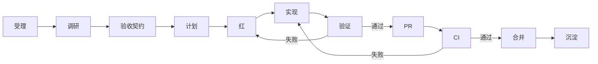

# DSH Work AI Native 交付工作流 v1

版本：v1.0

文档状态：冻结留存

规范状态：生效

英文基线：[`workflow.md`](workflow.md)（源修订 `17ae0657241f64e4b3ae0aeb1bccf0fb58be0ec1`）

落地跟踪：[Issue #1](https://github.com/zxheyi/dsh-work/issues/1)

## 目的与适用边界

每项变更从可观察的用户结果开始，经过可执行验收，最终形成可由他人独立复核的证据。代码只是交付过程的中间产物，不能单独证明完成。

本版本规定 DSH Work 仓库中功能、缺陷、架构、上游更新、文档和安全变更的共同交付路径。它定义仓库工作方式，不代表 M0 产品功能已经实现。当前产品实现状态以 [`acceptance/m0.md`](acceptance/m0.md) 及实际测试证据为准。

本文件是 v1 中文冻结快照。v1 之后的规则调整应修改英文事实源 [`workflow.md`](workflow.md)，并创建新的版本化中文记录，不回写本文件改变历史含义。

## 角色与责任

| 角色 | 负责内容 |
| --- | --- |
| 产品负责人 | 用户结果、优先级、非目标、产品风险和最终价值判断 |
| 实现 Agent | 调研、计划、失败检查、实现和针对性验证 |
| 验证者 | 独立核对验收标准、差异、测试、日志和截图 |
| 持续集成（CI） | 确定性的仓库、兼容性、平台和打包门禁 |

同一个人可以承担多个角色，但重要验证应使用干净上下文或独立 Agent。CI 独立于所有 Agent 的完成声明。

## 状态机

## 阶段契约

| 阶段 | 必需产物 | 退出标准 |
| --- | --- | --- |
| 受理 | Issue | 用户结果、受影响用户、范围和非目标明确 |
| 调研 | Issue 中的证据或决策草案 | 仓库/上游事实、备选方案和未知项已分开 |
| 验收契约 | 验收清单 | 正常、失败、恢复和安全标准均可客观测试 |
| 计划 | 垂直切片 | 每个切片可独立验证，每条标准均映射到检查 |
| 红 | 失败测试、复现或冒烟 | 行为改变前，检查因预期原因失败 |
| 实现 | 最小实现 | 当前切片通过目标检查且没有无关改动 |
| 验证 | 命令与证据 | 所有受影响验证层通过，未运行项如实记录 |
| PR | 可审查差异与模板 | 审查者能把每条验收标准映射到证据 |
| CI | 必需状态检查 | 仓库和受影响平台门禁有确定结论且通过 |
| 合并 | main 分支提交 | 受保护分支规则全部满足 |
| 沉淀 | 回归、决策或稳定文档 | 逃逸缺陷和稳定经验成为永久防线 |

## 受理

从 Issue 开始，而不是直接从实现提示开始。功能 Issue 描述问题、期望的用户可见结果、当前替代方案、受影响边界、验收标准和证据。缺陷 Issue 描述精确版本、环境、复现步骤、实际行为、期望行为、频率、诊断信息，以及适用时与干净 Profile 的对照结果。

Issue 满足以下条件才是 **Ready**：

- [ ] 用户结果能用一句话描述并客观测试；
- [ ] 范围和非目标明确；
- [ ] 已识别 Harness、DSH Work 与插件的职责归属；
- [ ] 正常、失败、恢复和安全路径都有验收标准；
- [ ] 每条验收标准都有验证方法；
- [ ] 工作已拆分为半天至一天的垂直切片；
- [ ] 风险和回滚方式已理解。

## 调研

涉及上游集成、公共接口、持久化、权限、技术选型、生产依赖和跨平台行为时必须调研。

调研产物应分开记录：

1. 有仓库或上游证据支持的已确认事实；
2. 备选方案及取舍；
3. 建议方向；
4. 未解决问题；
5. 可执行验证。

调研过程只读。只有验收契约稳定到足以让第一个检查变红时，才开始实现。

## 验收与计划

验收描述用户可观察行为，而不是偏好的实现。每条标准标明验证层：代码断言、集成检查、桌面端到端测试、截图、多轮 Eval 或人工产品判断。

计划采用垂直切片。避免“先完成全部 UI，再完成全部服务，最后补测试”的分层计划；优先交付“启动 Harness 并显示就绪”“报告端口冲突”“异常退出后恢复”等完整结果。

架构选择使用 [`decisions/TEMPLATE.md`](decisions/TEMPLATE.md)。条件允许时，决策应与大范围实现分开审查。

## 红与实现

修复缺陷前，将复现保留为失败回归检查。新增能力先添加最小失败验收或冒烟检查。没有测试基础设施时，建立测试基础设施就是第一个切片。

实现必须停留在已接受的切片内。新发现的边界冲突、破坏性迁移、安全决策或不可验证标准，会使任务返回“验收契约”或“调研”阶段。

## 验证阶梯

先运行最窄且有效的检查，再根据风险扩展：

| 变更类型 | 必需验证 |
| --- | --- |
| 契约或文档 | 契约门禁、链接、图表和事实一致性 |
| 纯本地逻辑 | 单元测试 |
| 配置或进程生命周期 | 单元测试与集成测试 |
| Harness 集成 | 针对固定源码/运行时策略的测试 |
| Profile、Bundle 或插件行为 | Loader 与 Profile 冒烟 |
| 桌面行为 | 进程集成与用户路径端到端测试 |
| UI 行为 | 交互断言与关键状态截图 |
| Agent 行为 | 正反用例与多轮 Eval |
| 权限或凭据 | 失败路径、明确授权和敏感数据检查 |
| 平台或打包 | Windows 与 macOS 原生构建及启动冒烟 |

实现 Agent 运行针对性检查。验证者在干净上下文中检查 Issue、验收标准、差异和证据。PR 只记录真实执行过的命令。

## Git 与 Pull Request

- 每个分支和 PR 只关联一个可独立验证的 Issue 用户结果。
- 分支保持短生命周期，差异保持可审查。
- 开始实现后使用 Conventional Commits。
- 上游源码固定版本、运行时包和产品行为分别提交，并优先拆成不同 PR。
- 行为变化同步更新测试与契约文档。
- 用户可见的桌面状态附带截图。
- 记录发布说明，或明确标注 `N/A`。
- 只有必需检查通过并满足 main 分支保护规则后才能合并。

## 任务路由

| 路由 | 附加契约 |
| --- | --- |
| 功能 | 用户场景、非目标、可执行验收，以及适用时的 E2E/Eval |
| 缺陷 | 修复前的复现和红色回归检查 |
| 架构 | 已接受决策，包含备选方案、后果、回滚和验证 |
| 上游更新 | 独立固定版本/包变更及完整兼容矩阵 |
| 文档 | 链接、图表、事实和语言一致性检查 |
| 安全 | 威胁边界、拒绝路径、授权行为和敏感数据证据 |

## 缺陷学习闭环

每个逃逸缺陷依次执行：

1. 复现缺陷；
2. 创建能变红的检查；
3. 确认已有门禁为什么未发现它；
4. 修复实现或契约；
5. 运行相关回归和仓库门禁；
6. 永久保留该用例；
7. 如果故障暴露系统性缺口，强化架构或诊断能力。

## 完成定义

- [ ] Issue 中的用户结果已经交付；
- [ ] 每条验收标准都映射到通过证据；
- [ ] 缺陷和行为变化都有回归保护；
- [ ] 针对性检查和受影响的更广检查均通过；
- [ ] 影响上游时已验证兼容性；
- [ ] 适用时，受影响平台和打包检查均通过；
- [ ] 变更关键 UI 状态具有视觉证据；
- [ ] PR 列出实际执行的命令和人工检查；
- [ ] 决策和稳定文档只在其事实源更新一次；
- [ ] 不包含无关改动；
- [ ] 风险和未解决工作明确；
- [ ] 必需 CI 有确定结论且通过。

## 扩展规则

有边界且可独立执行的调研与验证可以使用临时 Sub Agent。并行写入使用 worktree 并确保所有权不重叠。只有实际观察到并发或吞吐瓶颈，且当前验证闭环可信后，才引入持久团队、Change/Claim 协调、自动修复、合并队列或弹性 Runner。

## v1 落地验收

本规范的仓库基础设施满足以下条件后，才可声明 v1 工作流已落地：

- [ ] 中文 v1 冻结记录由契约门禁保护；
- [ ] Issue 与 PR 模板承载阶段契约；
- [ ] PR 自动检查关联 Issue、用户结果、验收证据、实际验证和风险回滚；
- [ ] 自动检查包含预期失败和修复后通过的证据；
- [ ] main 只能通过 PR 合并，并要求仓库契约与 PR 契约检查通过；
- [ ] main 禁止强制推送、删除和管理员绕过，并要求对话解决；
- [ ] 至少一个真实 Issue 和 PR 完整走通并留下可查询证据。

产品 build、集成、E2E、平台打包和运行时兼容检查按实际技术栈逐项加入。没有对应实现时保持“未运行”，不得用空操作升级为完成。
