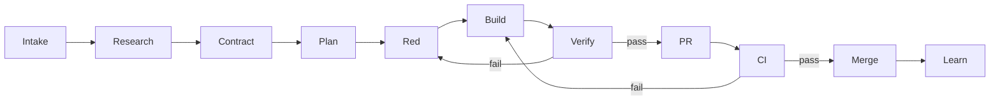

# DSH Work AI Native delivery workflow

Status: active contract

## Purpose

Every change begins with a user outcome, passes through executable acceptance, and ends with independently reviewable evidence. Code production is an intermediate step, not the definition of completion.

## Roles

| Role | Owns |
| --- | --- |
| Product owner | User outcome, priority, non-goals, product risk, and final value judgment |
| Implementation Agent | Research, plan, failing check, implementation, and targeted verification |
| Verifier | Independent comparison of acceptance criteria, diff, tests, logs, and screenshots |
| CI | Deterministic repository, compatibility, platform, and packaging gates |

One person may fill multiple roles, but important verification uses a clean context or independent Agent. CI remains independent of all Agent claims.

## State machine

## Stage contracts

| Stage | Required artifact | Exit criterion |
| --- | --- | --- |
| Intake | Issue | User outcome, affected users, scope, and non-goals are explicit |
| Research | Evidence in Issue or decision draft | Repository/upstream facts, alternatives, and unknowns are separated |
| Contract | Acceptance checklist | Every normal, failure, recovery, and security criterion is objectively testable |
| Plan | Vertical slices | Every slice is independently verifiable and every criterion maps to a check |
| Red | Failing test, reproduction, or smoke | The check fails for the intended reason before behavior changes |
| Build | Minimal implementation | Current slice passes its targeted check without unrelated changes |
| Verify | Commands and evidence | Every affected verification layer passes or is truthfully reported as not run |
| PR | Reviewable diff and template | A reviewer can map every acceptance criterion to evidence |
| CI | Required status checks | Repository and affected platform gates are conclusive and green |
| Merge | Main-branch commit | Protected-branch rules are satisfied |
| Learn | Regression, decision, or stable documentation | Escaped defects and stable lessons become permanent system defenses |

## Intake

Start from an Issue rather than an implementation prompt. A feature Issue describes the problem, desired user-visible outcome, current alternative, affected boundary, acceptance criteria, and evidence. A defect Issue describes exact versions, environment, reproduction, actual behavior, expected behavior, frequency, diagnostics, and a clean-Profile comparison when applicable.

An Issue is **Ready** only when:

- [ ] the user outcome is one sentence and objectively testable;
- [ ] scope and non-goals are explicit;
- [ ] Harness, DSH Work, and plugin ownership are identified;
- [ ] normal, failure, recovery, and security paths have acceptance criteria;
- [ ] every acceptance criterion has a verification method;
- [ ] the work is split into a half-day to one-day vertical slice;
- [ ] risks and rollback are understood.

## Research

Research is mandatory for upstream integration, public interfaces, persistence, permissions, technology selection, production dependencies, and cross-platform behavior.

The research artifact separates:

1. confirmed facts with repository or upstream evidence;
2. options and trade-offs;
3. the proposed direction;
4. unresolved questions;
5. executable verification.

Research sessions are read-only. Implementation starts only after the acceptance contract is stable enough to make the first check red.

## Acceptance and planning

Acceptance describes user-observable behavior, not preferred implementation. Each criterion names its verification layer: code assertion, integration check, desktop E2E, screenshot, multi-run Eval, or human product judgment.

Plans use vertical slices. Avoid layers such as “build all UI, then all services, then tests.” Prefer complete outcomes such as “start Harness and show ready,” “report a port conflict,” and “recover after abnormal exit.”

Architecture choices use `docs/decisions/TEMPLATE.md`. The decision is reviewed separately from broad implementation when practical.

## Red and build

For a defect, preserve the reproduction as a failing regression before fixing it. For a new capability, add the smallest failing acceptance or smoke check. When a test harness does not exist, creating that harness is the first slice.

Implementation stays inside the accepted slice. A newly discovered boundary conflict, destructive migration, security decision, or unverifiable criterion returns the task to Contract or Research.

## Verification ladder

Run the narrowest useful checks first and expand according to risk:

| Change | Required verification |
| --- | --- |
| Contract or documentation | Contract gate, links, diagrams, and factual consistency |
| Pure local logic | Unit tests |
| Configuration or process lifecycle | Unit and integration tests |
| Harness integration | Tests against the pinned source/runtime strategy |
| Profile, Bundle, or plugin behavior | Loader and Profile smoke |
| Desktop behavior | Process integration and user-path E2E |
| UI behavior | Interaction assertions and screenshots for key states |
| Agent behavior | Positive/negative cases and repeated Eval runs |
| Permissions or credentials | Negative paths, explicit approval, and sensitive-data checks |
| Platform or packaging | Native Windows/macOS build and launch smoke |

The implementation Agent runs targeted checks. The verifier examines the Issue, acceptance criteria, diff, and evidence in a clean context. The PR records only commands actually run.

## Git and pull requests

- Link each branch and pull request to one Issue outcome.
- Keep branches short-lived and diffs reviewable.
- Use conventional commits once implementation begins.
- Keep upstream pin changes, runtime package changes, and product behavior changes in separate commits and preferably separate pull requests.
- Update tests and contract documentation with behavior changes.
- Add screenshots for user-visible desktop states.
- Record release notes or state `N/A`.
- Merge only through the protected main branch after required checks pass.

## Task routes

| Route | Additional contract |
| --- | --- |
| Feature | User scenario, non-goals, executable acceptance, and E2E/Eval where applicable |
| Defect | Reproduction and red regression before the fix |
| Architecture | Accepted decision with alternatives, consequences, rollback, and verification |
| Upstream update | Dedicated pin/package change and the full compatibility matrix |
| Documentation | Link, diagram, factual, and language consistency checks |
| Security | Threat boundary, refusal paths, approval behavior, and sensitive-data evidence |

## Defect learning loop

Every escaped defect follows this sequence:

1. reproduce it;
2. create a check that goes red;
3. identify why existing gates missed it;
4. repair the implementation or contract;
5. run the relevant regression and repository gates;
6. retain the case permanently;
7. strengthen architecture or diagnostics when the failure exposed a systemic gap.

## Definition of Done

- [ ] the Issue user outcome is delivered;
- [ ] every acceptance criterion maps to passing evidence;
- [ ] defects and behavior changes have regression protection;
- [ ] targeted and affected broader checks pass;
- [ ] upstream compatibility is verified when affected;
- [ ] affected platform and packaging checks pass when applicable;
- [ ] UI evidence exists for changed key states;
- [ ] the PR lists actual commands and manual checks;
- [ ] decisions and stable documentation are updated once, at their source of truth;
- [ ] unrelated changes are absent;
- [ ] risks and unresolved work are explicit;
- [ ] required CI is conclusive and green.

## Scaling rule

Use temporary Sub Agents for bounded research and independent verification. Use worktrees for parallel writes with non-overlapping ownership. Introduce persistent teams, Change/Claim coordination, automatic repair, merge queues, or elastic runners only after the corresponding concurrency or throughput problem is observed and the current validation loop is trusted.
