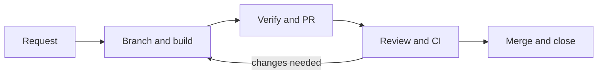

# DSH Work delivery workflow

Status: active contract, simplified 2026-09-07

This is the current workflow for GPT-6 Astra and other implementation agents. The [Chinese v1 record](workflow-v1.zh-CN.md) remains frozen history.

## State machine

## Stage contracts

| Step | Agent action | Done when |
| --- | --- | --- |
| Understand | Read the relevant code and repository rules. Record the outcome, scope, acceptance checks and rollback in an Issue. | The result is testable and ownership is clear. |
| Branch and build | Preserve unrelated changes. Fetch origin and create a short-lived branch from the latest `origin/main`. Implement one independently verifiable outcome with meaningful Conventional Commits. | The implementation and relevant tests satisfy the acceptance checks. |
| Verify and PR | Run targeted and affected checks. Push the branch and open a PR targeting `main`, linking `Closes #<issue>` and recording actual evidence. | The PR is reviewable; unrun checks and limitations are explicit. |
| Review and CI | Review the diff against the Issue, fix findings and CI failures, and resolve review conversations. Use independent verification for important changes. | Required CI and affected checks pass on the current revision. |
| Merge and close | With merge authorization, use **Create a merge commit**. Check main CI, close the Issue and clean up the merged branch/worktree when it has no remaining work. | The merged result is verified and any follow-up is recorded. |

## Autonomy and scope

For an ordinary request, keep the plan and evidence in the Issue and PR; a separate planning document is unnecessary. Investigate, implement and fix failed checks autonomously within the authorized scope. Ask only when material ambiguity, a major scope or architecture change, or missing authorization prevents safe progress. Existing authorization remains valid; do not ask for it again at each step.

A request to implement and submit a PR authorizes branch work, commits, push and PR creation, but does not by itself authorize merging. A request to merge after review and CI pass authorizes that final step too. Release is separate from merge.

Investigate upstream integration, persistence, permissions, dependencies and platform changes before implementation. Use an accepted [ADR](decisions/README.md) when changing a stable boundary or architecture. Split large requests into independently verifiable outcomes rather than adding ceremony to small ones.

## Upstream-first architecture

Harness owns the Agent runtime, sessions, models, tools, authorization and plugin lifecycle. DSH Work owns desktop integration and product presentation through native Profiles, Bundles and plugins. Keep pinned upstream source read-only and byte-clean. If public extension points cannot deliver the outcome, propose an upstream extension instead of duplicating Harness services.

## Git and pull requests

- Develop on a requirement branch, never directly on `main`. Suggested names: `feat/<issue>-<topic>`, `fix/<issue>-<topic>` and `docs/<issue>-<topic>`.
- Keep one independently verifiable Issue outcome per branch and PR. Use separate worktrees for concurrent work and stage only related changes.
- Preserve meaningful commits with **Merge commit**; do not use Squash merge or Rebase merge. Keep upstream pin, runtime package and product behavior updates in separate commits, preferably separate PRs.
- If main advances, merge the latest `origin/main` into the requirement branch, resolve conflicts and rerun affected checks. Preserving commit identity does not make old evidence cover new integration changes.
- Use the [PR template](../.github/pull_request_template.md). Include the user outcome, closing Issue reference, boundary, acceptance evidence, actual commands, risks, rollback and release notes (or `N/A`). Draft PRs may be incomplete; Ready PRs must satisfy the contract checker.
- Merge only through a PR after checks and review conversations are resolved. Follow the [main protection contract](../.github/BRANCH_PROTECTION.md). The single-maintainer baseline requires zero approving reviews; this does not replace review or important-change verification.

## Verification ladder

For behavior changes, first establish a failing regression, acceptance check or minimal smoke, then implement. Documentation changes use contract and factual checks. Run the narrowest useful check first and expand to the affected boundaries; do not repeat passing checks without a new reason.

| Change | Verification |
| --- | --- |
| Documentation or contract | Repository verifier tests, contract gate, links and factual consistency |
| Product logic | Targeted tests, `pnpm test`, `pnpm check` |
| Profile, Bundle or runtime | Affected Loader/Profile and runtime integration checks |
| Desktop or UI | Affected user-path E2E and key-state screenshots |
| Model, Agent or permissions | Positive, negative and recovery cases; repeated Eval where needed; sensitive-data checks |
| Platform or packaging | Affected native build and launch checks |

Report only commands actually run and bind evidence to the tested revision. A fixture model does not prove live-provider behavior, and one OS does not prove another. Current required GitHub checks are `contract` and `pull-request-contract`; additional affected checks still need evidence even when branch protection does not require them.

## Definition of Done

The requested outcome has passing acceptance evidence; related tests and necessary docs are updated; review findings are addressed; unrelated changes are excluded; risks and unrun checks are explicit. PR delivery ends at a reviewable PR. Authorized merge delivery additionally requires successful main CI and cleanup. Preserve discovered defects as regressions and record stable decisions at their source of truth. Merge does not declare a release ready.
